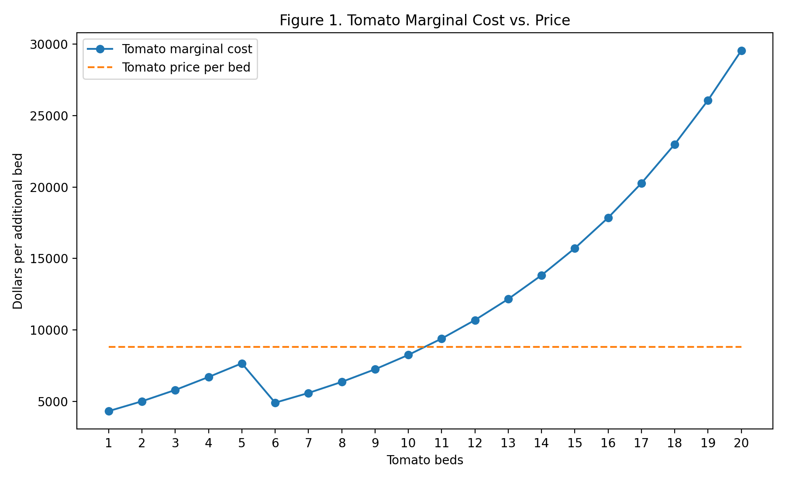
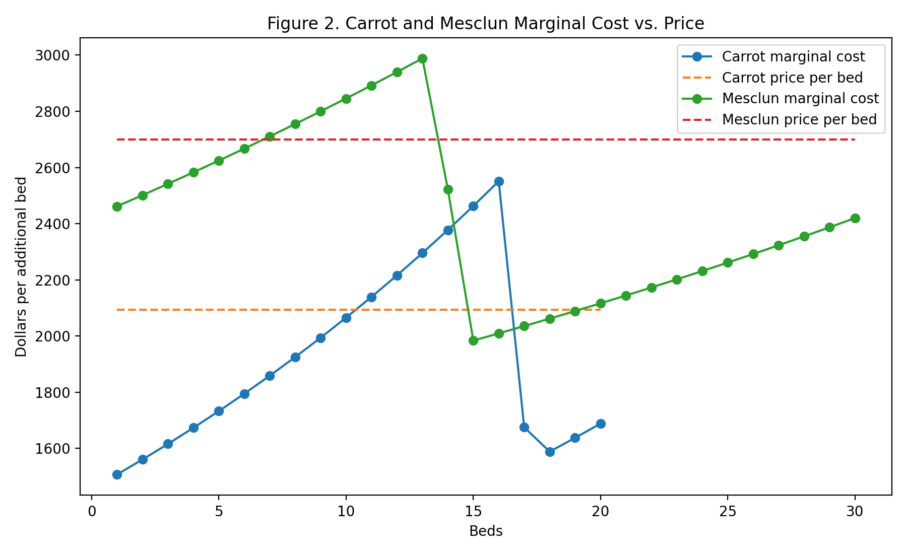

# Perfect Competition — Analysis

## 1. Where does the money crop stop, and why?

Tomatoes are clearly the highest-revenue crop because they bring in $8,800 per bed, which is much higher than carrots or mesclun. At first, this made me think the farm would want to plant tomatoes close to their full 20-bed limit. However, the model shows that the better stopping point is 10 tomato beds.

The reason comes down to marginal cost. At 10 tomato beds, the marginal cost of the 10th bed is about $8,248.11 (`MC Schedules!F16`). Since this is still below the $8,800 revenue earned from that bed, it is still worth planting. The situation changes with the 11th bed. Its marginal cost increases to about $9,390.17 (`MC Schedules!F17`), which is greater than the $8,800 that the bed would bring in.

This means the farm should stop at 10 tomato beds because the 11th bed would cost more to produce than it would generate in revenue. Even though tomatoes have the highest revenue per bed, that alone does not mean the farm should keep planting them. The decision depends on whether the revenue from the next bed is greater than the cost of producing that next bed.

Figure 1 makes this clear because the tomato marginal-cost curve crosses above the $8,800 price between the 10th and 11th beds.

## 2. Which constraints bind, and what would relaxing one be worth?

The model uses 10 tomato beds, 20 carrot beds, and 30 mesclun beds, for a total of 60 beds. Since the farm has 64 beds available, land itself is not a binding constraint. There are still 4 unused beds. The tomato cap is also not binding because only 10 of the allowed 20 tomato beds are used.

The carrot and mesclun caps are different. Carrots reach their full 20-bed limit and mesclun reaches its full 30-bed limit, meaning both of those constraints are binding. The marginal-cost numbers also show that both crops would still be worth expanding if the farm were allowed to plant more of them.

For carrots, the marginal cost of the 20th bed is about $1,688.37 compared with a price of $2,094 per bed. For mesclun, the marginal cost of the 30th bed is about $2,420 compared with a price of $2,700. In both cases, the price is still above marginal cost at the cap, so the crop limit is what stops the farm from expanding rather than the economics of the next bed.

The model also shows what relaxing these limits would be worth. Allowing one additional carrot bed would increase profit by about $353.10, while allowing one additional mesclun bed would increase profit by about $246.57. In comparison, adding another general bed of land would currently add $0 because the farm already has four unused beds.

Because of this, I would first look at whether the carrot-specific capacity could be expanded. It gives the largest increase in profit from one additional unit of capacity.

Figure 2 shows that carrots and mesclun are still economically attractive when they hit their limits, which helps explain why their caps are binding.

## 3. Does any marginal-cost curve ever fall, and what explains it?

One result that initially looked strange was the drop in tomato marginal cost between the 5th and 6th beds. The marginal cost of the 5th tomato bed is about $7,660.43, but the marginal cost of the 6th bed falls to about $4,906.02.

This does not happen because the physical amount of labor needed decreases. In fact, labor increases from about 724.73 hours at five tomato beds to about 956.64 hours at six beds. The important change is that the farm only has 720 hours of owner labor available.

Once the farm goes beyond the owner's available hours, it begins using temporary labor. The owner labor is valued at $34.72 per hour, while temporary labor costs only $17.36 per hour. Because the additional hours begin shifting toward a cheaper type of labor, the dollar cost of the next bed temporarily drops even though the total labor requirement continues to rise.

This helped me understand why marginal cost does not always have to increase smoothly. The physical production requirement is still increasing, but the cost of the resources being used changes at that point in the model.

## 4. Would each crop make money on its own, and does that matter?

If each crop had to cover the entire $20,000 fixed cost by itself, the results would be very different.

At 10 beds, tomatoes would produce about $6,176.17 in standalone profit. Their average variable cost is about $6,182.38 per bed, and their average total cost is about $8,182.38 compared with a price of $8,800. This means tomatoes are profitable even after being assigned the full fixed cost.

Carrots at 20 beds would show a standalone loss of about $16,480.20. Their average variable cost is about $1,918.01 per bed, while their price is $2,094. Mesclun at 30 beds would show a standalone loss of about $11,919.21, with an average variable cost of about $2,430.64 compared with its $2,700 price.

The standalone losses for carrots and mesclun do not mean that the farm should stop producing them. The $20,000 fixed cost exists regardless of whether another carrot or mesclun bed is planted. The more important short-run question is whether the revenue from the crop covers its variable cost and contributes something toward the fixed cost.

Both carrots and mesclun have prices above their average variable costs at these quantities. This means they still make a positive contribution toward covering the farm's fixed expenses, even though neither crop would cover the entire fixed cost if it were operating alone.

## Stage 1 hypothesis comparison

In Stage 1, I predicted that the optimal mix would be approximately 12 tomato beds, 20 carrot beds, and 30 mesclun beds. The model result is 10 tomato beds, 20 carrot beds, and 30 mesclun beds.

My prediction was correct for carrots and mesclun because both crops reached the maximum capacity I expected. Where I was wrong was tomatoes. I overestimated the optimal tomato quantity by two beds.

The biggest thing my original prediction missed was how quickly tomato marginal cost would move above the $8,800 price. The 10th tomato bed still has a marginal cost below price, but the 11th bed does not. Before building the model, I focused more on tomatoes having the highest revenue per bed and on their increasing labor requirements in general. The model made the stopping point much more specific by showing exactly where the cost of adding another tomato bed becomes greater than the revenue it produces.
